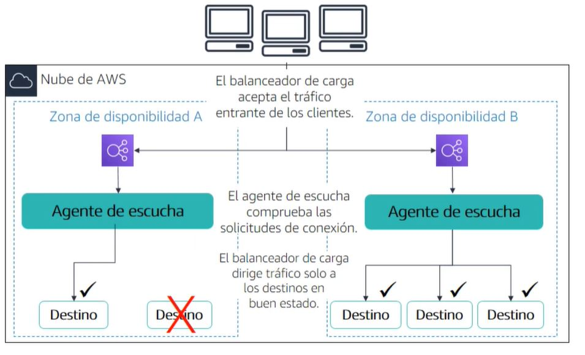
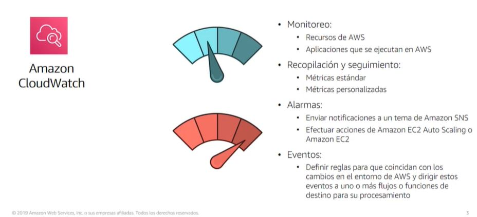
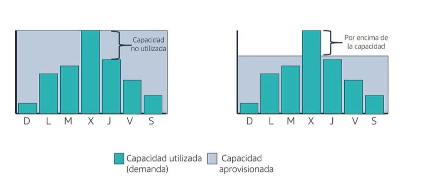

# Automatic scaling and monitoring 

## Elastic Load Balancing

Elastic Load Balancing automatically distributes incoming application traffic across multiple targets, such as Amazon EC2 instances, containers, IP addresses, and Lambda functions. It can handle the varying load of your application traffic in a single Availability Zone or across multiple Availability Zones. Elastic Load Balancing offers three types of load balancers that all feature the high availability, automatic scaling, and robust security necessary to make your applications fault tolerant.

### 3 types of load balancers

- Application Load Balancer
  - Best suited for load balancing of HTTP and HTTPS traffic
    - Route traffic to targets based on content of the request
    - Support for one or more listeners
    - Support for HTTP/2 and WebSocket
    - OSI Layer 7 - Application Layer

- Network Load Balancer
    - Best suited for load balancing of TCP traffic where extreme performance is required
        - Handle millions of requests per second
        - Support for static IP or Elastic IP addresses
        - Support for TCP, TLS, and UDP
        - OSI Layer 4 - Transport Layer
- Classic Load Balancer
    - Legacy Elastic Load Balancer
    - Support for EC2-Classic
    - Application layer and network layer load balancing

## Load Balancer use cases

- High availability and fault tolerance Application
- Elasticity and scalability
- Application security
- Application health monitoring
- Lambda function invocation
- Containerized application
- Virtual private cloud (VPC)
- Hybrid and multi-cloud architecture

### Monitoring for Elastic Load Balancing

- CloudWatch metrics
- Access logs
- CloudTrail logs

## Amazon CloudWatch

Amazon CloudWatch is a monitoring and observability service built for DevOps engineers, developers, site reliability engineers (SREs), and IT managers. CloudWatch provides you with data and actionable insights to monitor your applications, respond to system-wide performance changes, optimize resource utilization, and get a unified view of operational health. CloudWatch collects monitoring and operational data in the form of logs, metrics, and events, providing you with a unified view of AWS resources, applications, and services that run on AWS and on-premises servers. You can use CloudWatch to detect anomalous behavior in your environments, set alarms, visualize logs and metrics side by side, take automated actions, troubleshoot issues, and discover insights to keep your applications running smoothly.

### CloudWatch metrics

- CPU utilization
- Network traffic
- Disk I/O
- Status check
- Request count
- Latency
- HTTP status code
- HTTP status code count
- HTTP request method
- HTTP request count
- HTTP request count per target
- Target response time

## Amazon 2C2 Auto Scaling

Amazon EC2 Auto Scaling helps you maintain application availability and allows you to automatically add or remove EC2 instances according to conditions you define. You can use EC2 Auto Scaling for fleet management of EC2 instances to help maintain the health and availability of your fleet and ensure that you are running your desired number of Amazon EC2 instances. You can also use EC2 Auto Scaling for dynamic scaling of EC2 instances in response to changing demand. EC2 Auto Scaling is well suited both to applications that have stable demand patterns or that experience hourly, daily, or weekly variability in usage. EC2 Auto Scaling is enabled by Amazon CloudWatch and available at no additional charge beyond Amazon CloudWatch fees.

