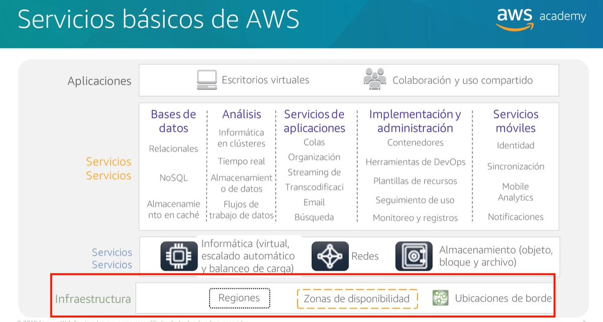
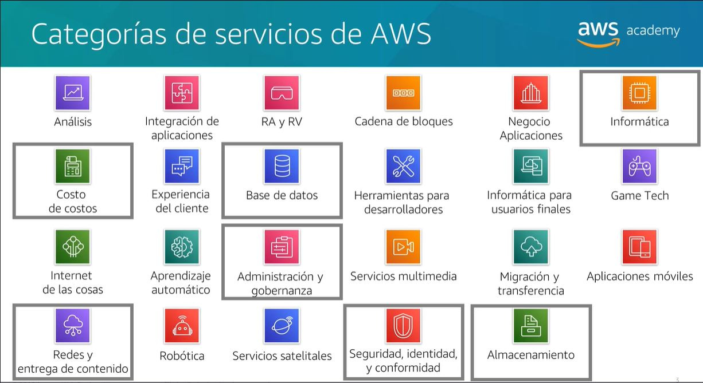

# Global Infrastructure Overview

## Section 1: AWS Global Infrastructure Overview

### AWS Global Infrastructure

AWS has 31 geographic regions around the world, with 99 availability zones and 216 edge locations. Each region is a separate geographic area. Each region has multiple, isolated locations known as availability zones. Each availability zone has redundant power, networking, and connectivity, housed in separate facilities. Each availability zone is isolated, but the availability zones in a region are connected through low-latency links. Each region is completely independent. This means that availability zones in different regions are isolated from each other. This is important because it means that if one region goes down, another region will not be affected.

- **Region**: A region is a physical location in the world that consists of one or more availability zones. Each region is a separate geographic area. Each region has multiple, isolated locations known as availability zones. Each availability zone has redundant power, networking, and connectivity, housed in separate facilities. Each availability zone is isolated, but the availability zones in a region are connected through low-latency links. Each region is completely independent. This means that availability zones in different regions are isolated from each other. This is important because it means that if one region goes down, another region will not be affected.

  - **Region Code**: A region code is a code that AWS uses to identify a region. For example, the region code for the US East (N. Virginia) region is us-east-1. The region code for the Asia Pacific (Mumbai) region is ap-south-1.
  - **Region Name**: A region name is a name that AWS uses to identify a region. For example, the region name for the US East (N. Virginia) region is US East (N. Virginia). The region name for the Asia Pacific (Mumbai) region is Asia Pacific (Mumbai).
  - **Region Endpoint**: A region endpoint is a URL that is used to access an AWS service in a region. For example, the region endpoint for the US East (N. Virginia) region is ec2.us-east-1.amazonaws.com. The region endpoint for the Asia Pacific (Mumbai) region is ec2.ap-south-1.amazonaws.com.

- **Availability Zone**: An availability zone is one or more discrete data centers with redundant power, networking, and connectivity in an AWS region. Availability zones enable you to operate production applications and databases that are more highly available, fault tolerant, and scalable than would be possible from a single data center. The availability zones in a region are connected through low-latency links. Availability zones are physically separated by a meaningful distance, many kilometers, from any other availability zone, although all are within 100 km (60 miles) of each other.
  - **Availability Zone Code**: An availability zone code is a code that AWS uses to identify an availability zone. For example, the availability zone code for the US East (N. Virginia) region is us-east-1a. The availability zone code for the Asia Pacific (Mumbai) region is ap-south-1a.

  - **Availability Zone Name**: An availability zone name is a name that AWS uses to identify an availability zone. For example, the availability zone name for the US East (N. Virginia) region is US East (N. Virginia) us-east-1a. The availability zone name for the Asia Pacific (Mumbai) region is Asia Pacific (Mumbai) ap-south-1a.
  - **Availability Zone Endpoint**: An availability zone endpoint is a URL that is used to access an AWS service in an availability zone. For example, the availability zone endpoint for the US East (N. Virginia) region is ec2.us-east-1a.amazonaws.com. The availability zone endpoint for the Asia Pacific (Mumbai) region is ec2.ap-south-1a.amazonaws.com.

if there is a problem with one availability zone, the other availability zones in the region are not affected. This is important because it means that if one availability zone goes down, another availability zone will not be affected.

### Factors to Consider When Choosing a Region

- Governance, compliance, and legal requirements
- Proximity to customers (latency)
- Available services
- Pricing

### Data centers

- Designed to offer a secure, redundant, and reliable environment for servers, storage, and networking equipment
- Each data center is designed to run independently from other data centers
- Each data center has between 50,000 and 80,000 servers

### Points of Presence

- AWS has 187 points of presence (EDGE LOCATIONS OR BORDER POINTS) .
- Amazon CloudFront uses these points of presence to distribute content to end users with low latency.
- Border Cache is a service that uses these points of presence to cache content that is stored in an S3 bucket. Low access frequency.

### AWS infrastructure characteristics

- **Scalable**: AWS infrastructure is designed to be highly scalable. You can scale up or down as needed.
- **Elastic**: AWS infrastructure is designed to be highly elastic. You can add or remove resources as needed.
- **Agile**: AWS infrastructure is designed to be highly agile. You can provision resources quickly and easily.
- **Error tolerant**: AWS infrastructure is designed to be highly error tolerant. You can provision resources in multiple availability zones to ensure that if one availability zone goes down, another availability zone will not be affected.
- **Highly available**: AWS infrastructure is designed to be highly available. You can provision resources in multiple availability zones to ensure that if one availability zone goes down, another availability zone will not be affected.
- **Secure**: AWS infrastructure is designed to be highly secure. You can use AWS security features to secure your resources.

## Section 2: AWS Global Infrastructure Services

There are 23 AWS services that are available in all regions. These services are known as global services. There are 15 AWS services that are available in all regions except China. These services are known as regional services. There are 10 AWS services that are available in one region only. These services are known as local services.

### AWS Storage Services

- **Amazon Simple Storage Service (Amazon S3)**: Amazon S3 is an object storage service that you can use to store and retrieve any amount of data, at any time, from anywhere on the web. Amazon S3 is designed to provide 99.999999999% durability of objects over a given year. This means that if you store 10,000,000 objects with Amazon S3, you can on average expect to incur a loss of a single object once every 10,000 years. Amazon S3 provides 99.99% availability of objects over a given year. Amazon S3 is designed to sustain the concurrent loss of data in two facilities.

- **Amazon Elastic Block Store (Amazon EBS)**: Amazon EBS is a block storage service that you can use to store persistent data. Amazon EBS volumes are designed to be highly available and reliable. Amazon EBS volumes are automatically replicated within an availability zone to protect you from component failure, offering high availability and durability. Amazon EBS volumes are designed to provide 99.999% availability and 99.999999999% durability.

- **Amazon Elastic File System (Amazon EFS)**: Amazon EFS is a file storage service that you can use to store persistent data. Amazon EFS is designed to provide massively parallel shared access to thousands of Amazon EC2 instances, enabling your applications to achieve high levels of aggregate throughput and IOPS with consistent low latencies. Amazon EFS is designed to provide 99.99% availability and 99.999999999% durability.

- **Amazon Glacier**: Amazon Glacier is a secure, durable, and extremely low-cost storage service for data archiving and long-term backup. Amazon Glacier provides three different retrieval options to fit your use case. Amazon Glacier is designed to provide 99.999999999% durability of objects over a given year. This means that if you store 10,000,000 objects with Amazon Glacier, you can on average expect to incur a loss of a single object once every 10,000 years. Amazon Glacier provides 99.99% availability of objects over a given year.

### AWS Compute Services

- **Amazon Elastic Compute Cloud (Amazon EC2)**: Amazon EC2 is a web service that provides resizable compute capacity in the cloud. Amazon EC2 provides you with complete control of your computing resources and lets you run on Amazon’s proven computing environment. Amazon EC2 provides you with flexible instance configurations, full control of your instances, and predictable costs. Amazon EC2 is designed to provide 99.99% availability of instances over a given year.

- **Amazon EC2 Auto Scaling**: Amazon EC2 Auto Scaling is a service that lets you launch and terminate Amazon EC2 instances automatically according to user-defined policies, schedules, and health checks. Amazon EC2 Auto Scaling is designed to maintain the availability of your Amazon EC2 instances and applications.

- **Amazon Elastic Container Service (Amazon ECS)**: Amazon ECS is a highly scalable, high-performance container orchestration service that supports Docker containers and allows you to easily run and scale containerized applications on AWS. Amazon ECS eliminates the need for you to install and operate your own container orchestration software, manage and scale a cluster of virtual machines, or schedule containers on those virtual machines.

- **Amazon EC2 Container Registry**: Amazon EC2 Container Registry is a fully managed Docker container registry that makes it easy for developers to store, manage, and deploy Docker container images. Amazon EC2 Container Registry eliminates the need to operate your own container repositories or worry about scaling the underlying infrastructure. Amazon EC2 Container Registry is integrated with Amazon EC2 Container Service (Amazon ECS), simplifying your development to production workflow.

- **AWS Elastic Beanstalk**: AWS Elastic Beanstalk is an easy-to-use service for deploying and scaling web applications and services developed with Java, .NET, PHP, Node.js, Python, Ruby, Go, and Docker on familiar servers such as Apache, Nginx, Passenger, and IIS. You can simply upload your code and Elastic Beanstalk automatically handles the deployment, from capacity provisioning, load balancing, and auto-scaling to application health monitoring. At the same time, you retain full control over the AWS resources powering your application and can access the underlying resources at any time.

- **AWS Lambda**: AWS Lambda is a compute service that lets you run code without provisioning or managing servers. AWS Lambda executes your code only when needed and scales automatically, from a few requests per day to thousands per second. You pay only for the compute time you consume—there is no charge when your code is not running. With AWS Lambda, you can run code for virtually any type of application or backend service—all with zero administration. AWS Lambda is designed to provide 99.99% availability of functions over a given month.

- **AWS Forgate**: AWS Forgate is a fully managed serverless compute service for running containers. AWS Forgate runs your containers on a serverless infrastructure that is managed by AWS. AWS Forgate scales automatically to handle increases in containerized application traffic. You pay only for the amount of vCPU and memory resources that your containerized application requests and the time your containerized application runs.

- **Amazon Elastic Kubernetes Service (Amazon EKS)**: Amazon EKS is a fully managed Kubernetes service. Amazon EKS runs the Kubernetes management infrastructure for you across multiple AWS availability zones to eliminate a single point of failure. Amazon EKS is certified Kubernetes conformant so you can use existing tooling and plugins from partners and the Kubernetes community. Applications running on any standard Kubernetes environment are fully compatible and can be easily migrated to Amazon EKS.

### AWS Database Services

- **Amazon Relational Database Service (Amazon RDS)**: Amazon RDS is a web service that makes it easy to set up, operate, and scale a relational database in the cloud. Amazon RDS provides cost-efficient and resizable capacity while automating time-consuming administration tasks such as hardware provisioning, database setup, patching, and backups. Amazon RDS is designed to provide 99.99% availability of instances over a given year.

- **Amazon DynamoDB**: Amazon DynamoDB is a fast and flexible NoSQL database service for all applications that need consistent, single-digit millisecond latency at any scale. It is a fully managed cloud database and supports both document and key-value store models. Its flexible data model, reliable performance, and automatic scaling of throughput capacity make it a great fit for mobile, web, gaming, ad tech, IoT, and many other applications. Amazon DynamoDB is designed to provide 99.999% availability of tables over a given year.

- **Amazon ElastiCache**: Amazon ElastiCache is a web service that makes it easy to deploy, operate, and scale an in-memory data store or cache in the cloud. The service improves the performance of web applications by allowing you to retrieve information from fast, managed, in-memory data stores, instead of relying entirely on slower disk-based databases. Amazon ElastiCache supports two open-source in-memory caching engines: Memcached and Redis. Amazon ElastiCache is designed to provide 99.99% availability of nodes over a given year.

- **Amazon Redshift**: Amazon Redshift is a fast, fully managed, petabyte-scale data warehouse service that makes it simple and cost-effective to analyze all your data using your existing business intelligence tools. Amazon Redshift is designed to provide 99.9% availability of clusters over a given year.

- **Amazon Aurora**: Amazon Aurora is a MySQL and PostgreSQL-compatible relational database built for the cloud, that combines the performance and availability of traditional enterprise databases with the simplicity and cost-effectiveness of open source databases. Amazon Aurora is up to five times faster than standard MySQL databases and three times faster than standard PostgreSQL databases. It provides the security, availability, and reliability of commercial databases at 1/10th the cost. Amazon Aurora is fully managed by Amazon Relational Database Service (RDS), which automates time-consuming administration tasks like hardware provisioning, database setup, patching, and backups.

### AWS Networking and Content Delivery Services

- **Amazon Virtual Private Cloud (Amazon VPC)**: Amazon VPC lets you provision a logically isolated section of the AWS Cloud where you can launch AWS resources in a virtual network that you define. You have complete control over your virtual networking environment, including selection of your own IP address range, creation of subnets, and configuration of route tables and network gateways. You can use both IPv4 and IPv6 in your VPC for secure and easy access to resources and applications. Amazon VPC is designed to provide 99.99% availability of the instances launched in each subnet over a given year.

- **Amazon CloudFront**: Amazon CloudFront is a global content delivery network (CDN) service that securely delivers data, videos, applications, and APIs to your viewers with low latency and high transfer speeds. CloudFront is integrated with AWS – both physical locations that are directly connected to the AWS global infrastructure, as well as other AWS services. CloudFront works seamlessly with services including AWS Shield for DDoS mitigation, Amazon S3, Elastic Load Balancing or Amazon EC2 as origins for your applications, and Lambda@Edge to run custom code closer to customers’ users and to customize the user experience. Lastly, if you use AWS origins such as Amazon S3, Amazon EC2 or Elastic Load Balancing, you don’t pay for any data transferred between these services and CloudFront.

- **Amazon Route 53**: Amazon Route 53 is a highly available and scalable cloud Domain Name System (DNS) web service. It is designed to give developers and businesses an extremely reliable and cost-effective way to route end users to Internet applications by translating names like www.example.com into the numeric IP addresses like

- **AWS Direct Connect**: AWS Direct Connect makes it easy to establish a dedicated network connection from your premises to AWS. Using AWS Direct Connect, you can establish private connectivity between AWS and your datacenter, office, or colocation environment, which in many cases can reduce your network costs, increase bandwidth throughput, and provide a more consistent network experience than Internet-based connections.

- **Elastic Load Balancing**: Elastic Load Balancing automatically distributes incoming application traffic across multiple targets, such as Amazon EC2 instances, containers, IP addresses, and Lambda functions. It can handle the varying load of your application traffic in a single Availability Zone or across multiple Availability Zones. Elastic Load Balancing offers three types of load balancers that all feature the high availability, automatic scaling, and robust security necessary to make your applications fault tolerant.

- **AWS Transit Gateway**: AWS Transit Gateway is a service that enables customers to connect their Amazon Virtual Private Clouds (VPCs) and their on-premises networks to a single gateway. As you grow the number of workloads running on AWS, you need to be able to scale your networks across multiple accounts and Amazon VPCs to keep up with the growth. AWS Transit Gateway reduces operational complexity and cost by enabling customers to connect their Amazon VPCs, AWS Transit Gateway, and their on-premises networks to a single gateway.

- **AWS VPN**: AWS VPN is comprised of two services: AWS Site-to-Site VPN and AWS Client VPN. Together, they deliver a highly-available, managed, and elastic cloud VPN solution to protect your network traffic. AWS Site-to-Site VPN creates encrypted tunnels between your network and your Amazon Virtual Private Clouds or AWS Transit Gateways. For managing remote access, AWS Client VPN connects your users to AWS or on-premises resources using a VPN software client.

### AWS Security, Identity, and Compliance Services

- **AWS Identity and Access Management (IAM)**: AWS Identity and Access Management (IAM) enables you to manage access to AWS services and resources securely. Using IAM, you can create and manage AWS users and groups, and use permissions to allow and deny their access to AWS resources.

- **AWS Artifact**: AWS Artifact is your go-to, central resource for compliance-related information that matters to you. It provides on-demand access to AWS’ security and compliance reports and select online agreements. Reports available in AWS Artifact include our Service Organization Control (SOC) reports, Payment Card Industry (PCI) reports, and certifications from accreditation bodies across geographies and compliance verticals that validate the implementation and operating effectiveness of AWS security controls.

- **AWS Organizations**: AWS Organizations helps you centrally govern your environment as you grow and scale your workloads on AWS. Whether you are a growing startup or a large enterprise, Organizations helps you to centrally manage billing; control access, compliance, and security; and share resources across your AWS accounts.

- **Amazon Cognito**: Amazon Cognito lets you add user sign-up, sign-in, and access control to your web and mobile apps quickly and easily. Amazon Cognito scales to millions of users and supports sign-in with social identity providers, such as Facebook, Google, and Amazon, and enterprise identity providers via SAML 2.0.

- **AWS Key Management Service (AWS KMS)**: AWS Key Management Service (KMS) makes it easy for you to create and manage cryptographic keys and control their use across a wide range of AWS services and in your applications. AWS KMS is a secure and resilient service that uses hardware security modules that have been validated under FIPS 140-2, or are in the process of being validated, to protect your keys. AWS KMS is integrated with AWS CloudTrail to provide you with logs of all key usage to help meet your regulatory and compliance needs.

- **AWS Shield**: AWS Shield is a managed Distributed Denial of Service (DDoS) protection service that safeguards applications running on AWS. AWS Shield provides always-on detection and automatic inline mitigations that minimize application downtime and latency, so there is no need to engage AWS Support to benefit from DDoS protection.

### AWS Cost Management Services

- **AWS Cost Explorer**: AWS Cost Explorer has an easy-to-use interface that lets you visualize, understand, and manage your AWS costs and usage over time. You can dive deep into your cost and usage data to identify trends, pinpoint cost drivers, and detect anomalies. You can also create custom reports and share them with colleagues.

- **AWS Budgets**: AWS Budgets gives you the ability to set custom budgets that alert you when your costs or usage exceed (or are forecasted to exceed) your budgeted amount. You can also use AWS Budgets to set reservation utilization or coverage targets and receive alerts when your utilization drops below the threshold you define. Leveraging AWS Budgets, you can optimize your costs and improve your overall AWS cost management.

- **AWS Cost and Usage Report**: The AWS Cost and Usage Report contains the most comprehensive information available on your costs and usage. The report contains line items that are broken out by the hour, product, Availability Zone, and tags that you define for your resources. You can configure the report to show your Reserved Instance utilization and Amazon EC2 Reserved Instance coverage and the amortized costs of your Reserved Instances over time. You can also customize the report to aggregate your data to the daily or monthly level.

### AWS Data Governance Services

- **AWS Management console**: The AWS Management Console is a web-based interface for accessing and managing your AWS services. Using the console, you can perform key tasks to successfully build and run your workloads on AWS. You can use the console to monitor your resources, manage your AWS CloudTrail log files, configure permissions for your resources, and more.

- **AWS CloudTrail**: AWS CloudTrail is a service that enables governance, compliance, operational auditing, and risk auditing of your AWS account. With CloudTrail, you can log, continuously monitor, and retain account activity related to actions across your AWS infrastructure. CloudTrail provides event history of your AWS account activity, including actions taken through the AWS Management Console, AWS SDKs, command line tools, and other AWS services. This event history simplifies security analysis, resource change tracking, and troubleshooting.

- **AWS Config**: AWS Config is a service that enables you to assess, audit, and evaluate the configurations of your AWS resources. Config continuously monitors and records your AWS resource configurations and allows you to automate the evaluation of recorded configurations against desired configurations. With Config, you can review changes in configurations and relationships between AWS resources, dive into detailed resource configuration histories, and determine your overall compliance against the configurations specified in your internal guidelines. This enables you to simplify compliance auditing, security analysis, change management, and operational troubleshooting.

- **AWS Cloudwatch**: Amazon CloudWatch is a monitoring and observability service built for DevOps engineers, developers, site reliability engineers (SREs), and IT managers. CloudWatch provides you with data and actionable insights to monitor your applications, respond to system-wide performance changes, optimize resource utilization, and get a unified view of operational health. CloudWatch collects monitoring and operational data in the form of logs, metrics, and events, providing you with a unified view of AWS resources, applications, and services that run on AWS and on-premises servers.

- **AWS Auto scaling**: AWS Auto Scaling monitors your applications and automatically adjusts capacity to maintain steady, predictable performance at the lowest possible cost. Using AWS Auto Scaling, it’s easy to setup application scaling for multiple resources across multiple services in minutes. The service provides a simple, powerful user interface that lets you build scaling plans for resources including Amazon EC2 instances and Spot Fleets, Amazon ECS tasks, Amazon DynamoDB tables and indexes, and Amazon Aurora Replicas. AWS Auto Scaling makes scaling simple with recommendations that allow you to optimize performance, costs, or balance between them. If you’re already using Amazon EC2 Auto Scaling to dynamically scale your Amazon EC2 instances, you can now combine it with AWS Auto Scaling to scale additional resources for other AWS services. With AWS Auto Scaling, your applications always have the right resources at the right time.

- **AWS Trusted Advisor**: AWS Trusted Advisor is an online tool that provides you real time guidance to help you provision your resources following AWS best practices. Trusted Advisor checks help optimize your AWS infrastructure, increase security and performance, reduce your overall costs, and monitor service limits.

- **AWS Well-Architected Tool**: The AWS Well-Architected Tool helps you review the state of your workloads and compares them to the latest AWS architectural best practices. The AWS Well-Architected Tool provides a consistent process for you to review and measure your architecture using the AWS Well-Architected Framework. The tool is based on five pillars — operational excellence, security, reliability, performance efficiency, and cost optimization. It provides a set of questions that you can use to evaluate AWS workloads or a specific workload called a lens. Each question includes a set of best practices and guidance on resources to review to improve your workloads.

- **AWS Command Line Interface**: The AWS Command Line Interface (CLI) is a unified tool to manage your AWS services. With just one tool to download and configure, you can control multiple AWS services from the command line and automate them through scripts. The AWS CLI introduces a new set of simple file commands for efficient file transfers to and from Amazon S3.

### Questions

1- Which component of AWS infrastructure uses CloudFront to deliver with low latency and high data transfer speeds?

R: Edge Locations (Edge locations are endpoints for AWS which are used for caching content. Typically, this consists of CloudFront, Amazon’s Content Delivery Network (CDN).)