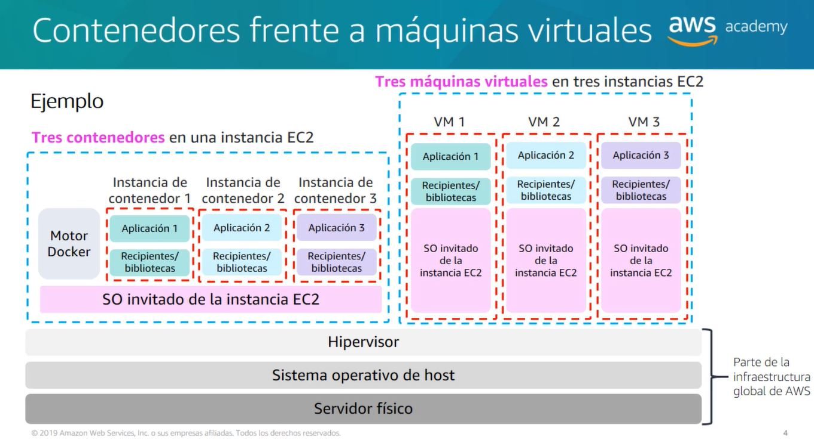

# Compute

## Overview

In this module, you will learn about the following AWS compute services:

- Amazon Elastic Compute Cloud (Amazon EC2)
- Amazon Elastic Container Service (Amazon ECS)
- AWS Elastic Beanstalk
- AWS Lambda
- AWS Batch
- Amazon Lightsail
- AWS Serverless Application Repository
- AWS Outposts
- Amazon Elastic container Registry (Amazon ECR)
- AWS Fargate
- AWS Auto Scaling
- AWS kubernetes Service (Amazon EKS)

## Amazon Elastic Compute Cloud (Amazon EC2)

- Amazon Elastic Compute Cloud (Amazon EC2) is a web service that provides secure, resizable compute capacity in the cloud. It is designed to make web-scale cloud computing easier for developers.
- Amazon EC2’s simple web service interface allows you to obtain and configure capacity with minimal friction. It provides you with complete control of your computing resources and lets you run on Amazon’s proven computing environment.
- Provides virtual machines, called instances, for compute capacity. Full control over SO (Windows, Linux, etc.), networking, and security.

## 9 key decisions for Amazon EC2

1. **AMI** - An Amazon Machine Image (AMI) provides the information required to launch an instance. You must specify an AMI when you launch an instance. You can launch multiple instances from a single AMI when you need multiple instances with the same configuration. You can use different AMIs to launch instances when you need instances with different configurations.

2. **Instance Type** - Amazon EC2 provides a wide selection of instance types optimized to fit different use cases. Instance types comprise varying combinations of CPU, memory, storage, and networking capacity and give you the flexibility to choose the appropriate mix of resources for your applications. Each instance type includes one or more instance sizes, allowing you to scale your resources to the requirements of your target workload.

3. **Network** - Amazon EC2 provides you with several options for configuring your instances to access your Amazon Virtual Private Cloud (Amazon VPC). You can launch your instances into a subnet in a VPC. If your account supports EC2-Classic, you can launch your instances into EC2-Classic or into a VPC. For more information about EC2-Classic, see Amazon EC2 and Amazon Virtual Private Cloud.
4. **IAM** - You can use AWS Identity and Access Management (IAM) to manage access to your AWS resources. For example, you can create users in IAM and then define which AWS resources each user can access and what actions they can perform on those resources. You can also use IAM to create roles and manage permissions to control access to AWS resources.
5. **User Data** - You can specify user data when you launch an instance. For example, you can specify shell scripts or commands that automate tasks after you launch the instance, or that customize the instance. For more information, see Running Commands on Your Linux Instance at Launch.
6. **Storage** - Amazon EC2 provides you with flexible, cost-effective, and easy-to-use data storage options for your instances. Each option is highly available, highly durable, and supports seamless integration with a wide variety of popular applications.
7. **Tags** - You can tag your Amazon EC2 resources, such as instances and volumes, to help you manage your resources. For example, you can use the following tag keys: Name, Purpose, or Environment. Each tag key can have more than one value. For example, you might have key values of Development, Test, and Production for the Environment key. For more information, see Tagging Your Amazon EC2 Resources.
8. **Security Groups** - A security group acts as a virtual firewall for your instance to control inbound and outbound traffic. When you launch an instance in a VPC, you can assign up to five security groups to the instance. Security groups act at the instance level, not the subnet level. Therefore, each instance in a subnet in your VPC could be assigned to a different set of security groups. If you don't specify a security group when you launch an instance, the instance is automatically assigned to the default security group for the VPC. For more information, see Security Groups for Your VPC.
9. **Key Pair** - Amazon EC2 uses public–key cryptography to encrypt and decrypt login information. Public–key cryptography uses a public key to encrypt a piece of data, such as a password, then the recipient uses the private key to decrypt the data. The public and private keys are known as a key pair. To log in to your instance, you must create a key pair, specify the name of the key pair when you launch the instance, and provide the private key when you connect to the instance. You can use the same key pair with instances launched from any Amazon Machine Image (AMI) from any AWS Region. You can also use the same key pair for an instance launched from the same AMI multiple times. You can't use the same key pair for instances launched from different AMIs.

## Launching an Amazon EC2 Instance
- Launch instance wizard
- Progamatic Launch (commands)
- IP is dynamic by default -  if static IP is needed, use Elastic IP.

## Cost optimization for Amazon EC2

- **Reserved Instances** - Reserved Instances provide you with a significant discount (up to 75%) compared to On-Demand instance pricing. In addition, when Reserved Instances are assigned to a specific Availability Zone, they provide a capacity reservation, giving you additional confidence in your ability to launch instances when you need them.
- **Spot Instances** - Amazon EC2 Spot Instances let you take advantage of unused EC2 capacity in the AWS cloud. Spot Instances are available at up to a 90% discount compared to On-Demand prices. You can use Spot Instances for various stateless, fault-tolerant, or flexible applications such as big data, containerized workloads, CI/CD, web servers, high-performance computing (HPC), and other test & development workloads.
- **Dedicated Hosts** - A Dedicated Host is a physical EC2 server dedicated for your use. Dedicated Hosts can help you reduce costs by allowing you to use your existing server-bound software licenses, including Windows Server, SQL Server, and SUSE Linux Enterprise Server (subject to your license terms), and can also help you meet compliance requirements. Dedicated Hosts are physically isolated from other EC2 instances and use of the host is controlled by you.
- **Ondemand instances** - Pay for compute capacity by the second with no long-term commitments. You can increase or decrease your compute capacity depending on the demands of your application and only pay the specified per hourly rates for the instance you use.
- **reserved instances** - Reserved Instances provide you with a significant discount (up to 75%) compared to On-Demand instance pricing. In addition, when Reserved Instances are assigned to a specific Availability Zone, they provide a capacity reservation, giving you additional confidence in your ability to launch instances when you need them.

## 4 pillars of cost optimization
1. **Right size your instances** - Right Sizing is the process of matching the workload requirements with the lowest cost option. This can be done by selecting the right instance type, size, and number of instances.
2. **Increase elasticity** - Elasticity is the ability to scale your resources up or down as needed. This can be done by using Auto Scaling, which automatically adjusts the number of instances in a group based on the conditions you define.
3. **Purchase options** - Purchase Options are the different ways you can purchase your instances. This can be done by using On-Demand, Reserved, or Spot Instances.
4. **Storage optimization** - Storage Optimization is the process of selecting the lowest cost storage option that meets your needs. This can be done by using the right storage class, size, and lifecycle policies.

## Containers

- Containers are a method of operating system virtualization that allow you to run an application and its dependencies in resource-isolated processes. Containers allow you to easily package an application's code, configurations, and dependencies into easy-to-use building blocks that deliver environmental consistency, operational efficiency, developer productivity, and version control. Containers can help ensure that applications deploy quickly, reliably, and consistently regardless of deployment environment.
- Containers are a standard unit of software that packages up code and all its dependencies so the application runs quickly and reliably from one computing environment to another. A Docker container image is a lightweight, standalone, executable package of software that includes everything needed to run an application: code, runtime, system tools, system libraries and settings.

## Amazon Elastic Container Service (Amazon ECS)

- Amazon Elastic Container Service (Amazon ECS) is a fully managed container orchestration service. Customers such as Duolingo, Samsung, GE, and Cookpad use ECS to run their most sensitive and mission critical applications because of its security, reliability, and scalability.
- Amazon ECS is a highly scalable, fast, container management service that makes it easy to run, stop, and manage Docker containers on a cluster. You can host your cluster on a serverless infrastructure that is managed by Amazon ECS by launching your services or tasks using the Fargate launch type. For more control, you can host your tasks on a cluster of Amazon Elastic Compute Cloud (Amazon EC2) instances that you manage by using the EC2 launch type. For more information about launch types, see Amazon ECS Launch Types.

## Fargate

- AWS Fargate is a serverless compute engine for containers that works with both Amazon Elastic Container Service (ECS) and Amazon Elastic Kubernetes Service (EKS). Fargate makes it easy for you to focus on building your applications. Fargate removes the need to provision and manage servers, lets you specify and pay for resources per application, and improves security through application isolation by design.

## Kubernetes

- Kubernetes is an open-source system for automating deployment, scaling, and management of containerized applications.
- Kubernetes is a portable, extensible, open-source platform for managing containerized workloads and services, that facilitates both declarative configuration and automation. It has a large, rapidly growing ecosystem. Kubernetes services, support, and tools are widely available.
- Kubernetes provides you with a framework to run distributed systems resiliently. It takes care of scaling and failover for your application, provides deployment patterns, and more. For example, Kubernetes can easily manage a canary deployment for your system.

## Amazon Elastic Kubernetes Service (Amazon EKS)

- Amazon Elastic Kubernetes Service (Amazon EKS) is a fully managed Kubernetes service. Customers such as Intel, Snap, Intuit, GoDaddy, and Autodesk trust EKS to run their most sensitive and mission critical applications because of its security, reliability, and scalability.
- Amazon EKS runs the Kubernetes management infrastructure for you across multiple AWS availability zones to eliminate a single point of failure. Amazon EKS is certified Kubernetes conformant so you can use existing tooling and plugins from partners and the Kubernetes community. Applications running on any standard Kubernetes environment are fully compatible and can be easily migrated to Amazon EKS.

## Amazon Elastic Container Registry (Amazon ECR)

- Amazon Elastic Container Registry (Amazon ECR) is a fully managed container registry that makes it easy to store, manage, share, and deploy your container images and artifacts anywhere. Amazon ECR eliminates the need to operate your own container repositories or worry about scaling the underlying infrastructure. Amazon ECR hosts your images in a highly available and scalable architecture, allowing you to reliably deploy containers for your applications. Integration with AWS Identity and Access Management (IAM) provides resource-level control of each repository. With Amazon ECR, there are no upfront fees or commitments. You pay only for the amount of data you store in your repositories and data transferred to the Internet.

## AWS Lambda

- AWS Lambda is a serverless compute service that lets you run code without provisioning or managing servers, creating workload-aware cluster scaling logic, maintaining event integrations, or managing runtimes. With Lambda, you can run code for virtually any type of application or backend service - all with zero administration. Just upload your code as a ZIP file or container image, and Lambda automatically and precisely allocates compute execution power and runs your code based on the incoming request or event, for any scale of traffic. You can set up your code to automatically trigger from 140 AWS services or call it directly from any web or mobile app.

## Amazon Route 53

- Amazon Route 53 is a highly available and scalable cloud Domain Name System (DNS) web service. It is designed to give developers and businesses an extremely reliable and cost-effective way to route end users to Internet applications by translating names like www.example.com into the numeric IP addresses like.
- Amazon Route 53 effectively connects user requests to infrastructure running in AWS – such as Amazon EC2 instances, Elastic Load Balancing load balancers, or Amazon S3 buckets – and can also be used to route users to infrastructure outside of AWS. You can use Amazon Route 53 to configure DNS health checks to route traffic to healthy endpoints or to independently monitor the health of your application and its endpoints. Amazon Route 53 Traffic Flow makes it easy for you to manage traffic globally through a variety of routing types, including Latency Based Routing, Geo DNS, and Weighted Round Robin—all of which can be combined with DNS Failover in order to enable a variety of low-latency, fault-tolerant architectures. Using Amazon Route 53 Traffic Flow’s simple visual editor, you can easily manage how your end-users are routed to your application’s endpoints—whether in a single AWS region or distributed around the globe. Amazon Route 53 also offers Domain Name Registration – you can purchase and manage domain names such as example.com and Amazon Route 53 will automatically configure DNS settings for your domains.

1. **simple routing** - Simple routing lets you route internet traffic to a single resource.
2. **weighted routing** - Weighted routing lets you split your traffic based on different weights assigned to the routes.
3. **latency-based routing** - Latency-based routing lets you route your traffic based on the lowest network latency for your end user.
4. **failover routing** - Failover routing lets you route your traffic based on the health of your endpoints.
5. **geolocation routing** - Geolocation routing lets you choose the resources that serve your traffic based on the geographic location of your users.
6. **multivalue answer routing** - Multivalue answer routing lets you configure Amazon Route 53 to return multiple values, such as IP addresses for your web servers, in response to DNS queries. You can specify multiple values for almost any record, but multivalue answer routing also lets you check the health of each resource, so Amazon Route 53 returns only values for healthy resources. If all the resources are unhealthy, Amazon Route 53 can return up to eight healthy records using multivalue answer routing.
7. **geoproximity routing** - Geoproximity routing lets Amazon Route 53 route traffic to your resources based on the geographic location of your users and your resources. You can also optionally choose to route more traffic or less to a given resource by specifying a value, known as a bias. A bias expands or shrinks the size of the geographic region from which traffic is routed to a resource.

## Amazon CloudFront

- Amazon CloudFront is a fast content delivery network (CDN) service that securely delivers data, videos, applications, and APIs to customers globally with low latency, high transfer speeds, all within a developer-friendly environment.
- CloudFront is integrated with AWS – both physical locations that are directly connected to the AWS global infrastructure, as well as other AWS services. CloudFront works seamlessly with services including AWS Shield for DDoS mitigation, Amazon S3, Elastic Load Balancing or Amazon EC2 as origins for your applications, and Lambda@Edge to run custom code closer to customers’ users and to customize the user experience. Lastly, if you use AWS origins such as Amazon S3, Amazon EC2 or Elastic Load Balancing, you don’t pay for any data transferred between these services and CloudFront.

