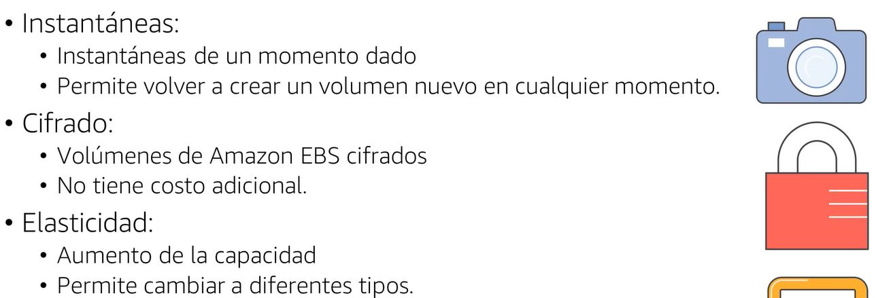
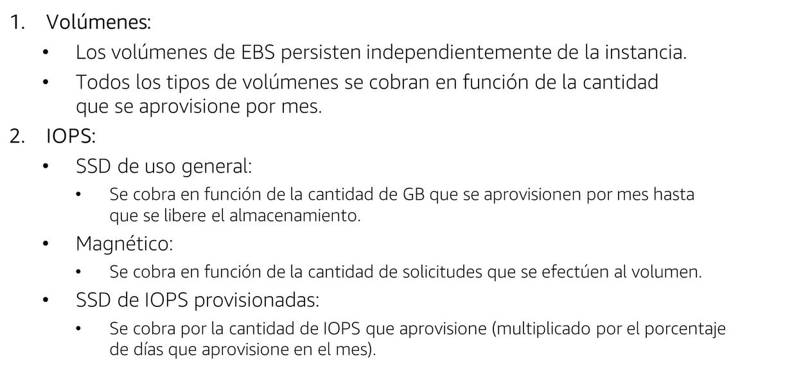
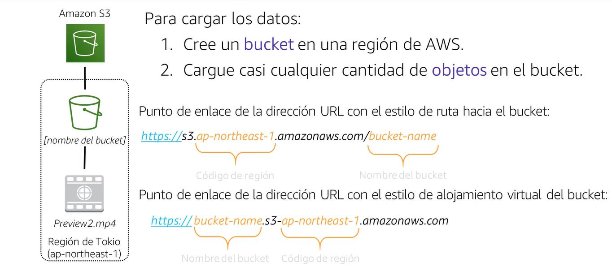
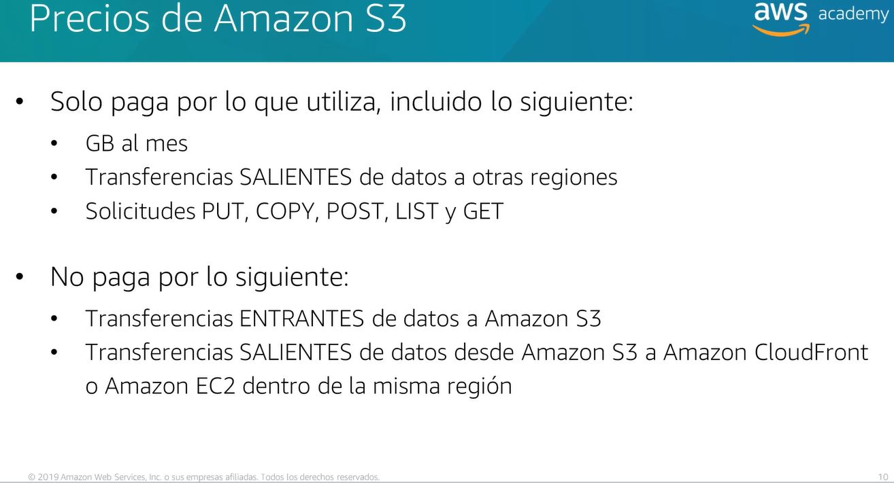
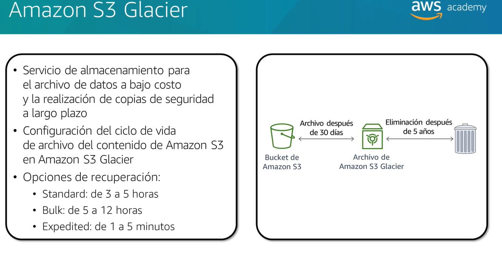

## Storage

## Amazon Elastic Block Store (Amazon EBS)

- Amazon EBS provides block level storage volumes for use with EC2 instances
- Amazon EBS volumes are network-attached, and persist independently from the life of an instance
- Amazon EBS volumes are highly available and reliable storage volumes that can be attached to any running instance that is in the same Availability Zone
- Amazon EBS volumes that are attached to an EC2 instance are exposed as storage volumes that persist independently from the life of the instance
- Low latency block storage volumes that can be used as boot volumes or attached to EC2 instances
- snapshot feature allows you to create a backup of your volume at a point in time
  - snapshots are incremental backups, meaning that only the blocks on the device that have changed after your most recent snapshot are saved
  - the cost of your snapshot storage is proportional to the amount of data stored in the snapshot and is charged at the same rate as Amazon EBS volumes. GB-month stored.
- data persists on the volume until the volume is deleted, regardless of the status of the instance
- Amazon EBS encryption feature supports encryption of data volumes and boot volumes

## Amazon EBS Volume Features
Amazon EBS volumes deliver the following features:

- Persistent storage: Volume lifetime is independent of any particular Amazon EC2 instance.

- General purpose: Amazon EBS volumes are raw, unformatted block devices that can be used from any operating system.

- High performance: Amazon EBS volumes are equal to or better than local Amazon EC2 drives.

- High reliability: Amazon EBS volumes have built-in redundancy within an Availability Zone.

- Designed for resiliency: The AFR (Annual Failure Rate) of Amazon EBS is between 0.1% and 1%.

- Variable size: Volume sizes range from 1 GB to 16 TB.

- Easy to use: Amazon EBS volumes can be easily created, attached, backed up, restored, and deleted.

## Amazon simple storage service (Amazon S3)

- Amazon S3 is object storage built to store and retrieve any amount of data from anywhere
- It is designed to deliver 99.999999999% durability, and scale past trillions of objects worldwide
- Amazon S3 is a simple key, value store designed to store as many objects as you want
- Objects can be up to 5 TB in size. There is no minimum limit on the size of an object.

### Amazon s3 storage classes

- Amazon S3 Standard
  - 99.99% availability
  - 99.999999999% durability
  - stored redundantly across multiple devices in multiple facilities, and is designed to sustain the loss of 2 fa
- Amazon S3 Standard-Infrequent Access (Amazon S3 Standard-IA)
    - 99.99% availability
    - 99.999999999% durability
    - stored redundantly across multiple devices in multiple facilities, and is designed to sustain the loss of 2 fa
    - lower fee than Amazon S3 Standard
    - suitable for data that is less frequently accessed, but requires rapid access when needed
- Amazon S3 One Zone-Infrequent Access (Amazon S3 One Zone-IA)
    - 99.5% availability
    - 99.999999999% durability
    - stored redundantly in a single facility, and is designed to sustain the loss of that facility
    - lower fee than Amazon S3 Standard-IA
    - suitable for data that is infrequently accessed, but requires rapid access when needed
- Amazon S3 Intelligent-Tiering
    - 99.9% availability
    - 99.999999999% durability
    - designed to optimize costs by automatically moving data to the most cost-effective access tier, without performance impact or operational overhead
    - suitable for unknown or changing access patterns
- Amazon S3 Glacier
    - 99.99% availability
    - 99.999999999% durability
    - low-cost storage class for data archiving
    - suitable for data archiving   
- Amazon S3 Glacier Deep Archive
    - 99.99% availability
    - 99.999999999% durability
    - lowest-cost storage class for long-term data archiving and digital preservation
    - suitable for long-term data archival or digital preservation

### Buckets

- A bucket is a container for objects stored in Amazon S3
- Every object is contained in a bucket
- For each object, you can grant read and write permissions to users and groups of users or to anonymous users
- You can also grant permission to view your buckets and objects to other AWS accounts
- You can store any number of objects in a bucket
- You can store an unlimited amount of data in a bucket
- You can create up to 100 buckets in each of your AWS accounts
- You can choose a region to optimize for latency, minimize costs, or address regulatory requirements
- You can configure your bucket to create access logs, which log all requests made to your bucket
- You can configure your bucket to serve static websites

- GET, PUT, DELETE, and LIST are the most commonly used HTTP methods supported by Amazon S3
- GET is used to retrieve information about objects
- PUT is used to create objects
- DELETE is used to delete objects
- LIST is used to list objects in a bucket
-GET is charged for each request and for the amount of data transferred in response to the request (data transfer out).

## Amazon Elastic File System (Amazon EFS)

- Amazon EFS provides a simple, scalable, fully managed elastic NFS file system for use with AWS Cloud services and on-premises resources
- It is built to scale on demand to petabytes without disrupting applications, growing and shrinking automatically as you add and remove files, so your applications have the storage they need – when they need it
- Amazon EFS is designed to provide massively parallel shared access to thousands of Amazon EC2 instances, enabling your applications to achieve high levels of aggregate throughput and IOPS with consistent low latencies
- Amazon EFS is a regional service storing data within and across multiple Availability Zones (AZs) for high availability and durability
- Amazon EFS file systems can also be accessed from on-premises servers or instances running outside of the Amazon EC2 environment
- Amazon EFS provides file storage in the AWS Cloud
- Amazon EFS is a file storage service for use with Amazon EC2
- Amazon EFS provides a file system interface, file system access semantics (such as strong consistency and file locking), and concurrently-accessible storage for up to thousands of Amazon EC2 instances

### Amazon EFS 5 steps

- Create Amazon EC2 resources and launch instances.
- Create an Amazon EFS file system.
- Mount the Amazon EFS file system on your Amazon EC2 instances.
- Connect to your Amazon EC2 instances and test your file system.
- Verify resources and security.

## Amazon S3 Glacier

- Amazon S3 Glacier is a secure, durable, and extremely low-cost cloud storage service for data archiving and long-term backup
- It is designed to deliver 99.999999999% durability, and provides comprehensive security and compliance capabilities that can help meet even the most stringent regulatory requirements
- Amazon S3 Glacier provides query-in-place functionality, allowing you to run powerful analytics directly on your archive data at rest
- You can store any kind of data in any format
- You can store an unlimited amount of data in a vault
- You can create up to 1,000 vaults in each of your AWS accounts
- You can choose a region to optimize for latency, minimize costs, or address regulatory requirements
- You can configure your vault to create access logs, which log all requests made to your vault.

### Archive

- An archive is a collection of objects and their associated metadata
- Archives are stored in vaults

### Vault

- A vault is a container for archives
- Every archive is contained in a vault
- You can store any number of archives in a vault

