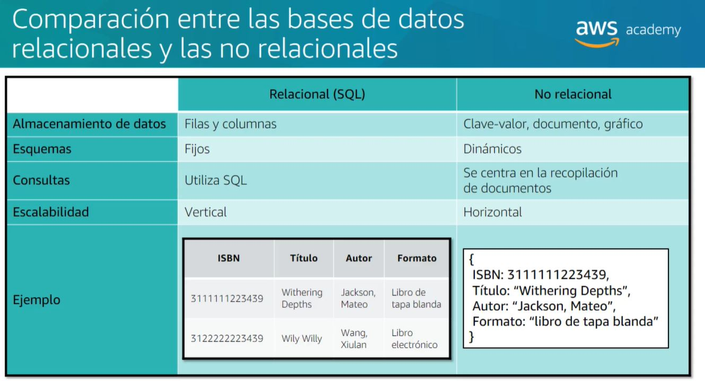

# Data Bases in AWS

## Introduction

- A database is a collection of data that is organized so that it can be easily accessed, managed and updated

## Database Categories

- Managed Databases: fault tolerant, scalable, and fully managed (automated backups, software patching, automatic failure detection and recovery, data replication, and data snapshots)
  - Amazon Relational Database Service (Amazon RDS)
    - Amazon Aurora
    - Amazon DynamoDB
    - Amazon Redshift
- Unmanaged Databases: you manage the database yourself (you are responsible for provisioning capacity, monitoring and patching the operating system and database software, backing up data, and implementing disaster recovery)
  - Amazon EC2
    - Amazon Elastic Block Store (Amazon EBS)
    - Amazon Elastic File System (Amazon EFS)
    - Amazon Simple Storage Service (Amazon S3)

## Amazon Relational Database Service (Amazon RDS)

- Amazon RDS is a web service that makes it easy to set up, operate, and scale a relational database in the cloud (MySQL, PostgreSQL, MariaDB, Oracle Database, Amazon Aurora and SQL Server)
- Amazon RDS provides cost-efficient and resizable capacity while automating time-consuming administration tasks such as hardware provisioning, database setup, patching and backups
- Amazon RDS is available on several database instance types - optimized for memory, performance or I/O - and provides you with six familiar database engines to choose from, including Amazon Aurora, PostgreSQL, MySQL, MariaDB, Oracle Database, and SQL Server
- You can use the AWS Database Migration Service to easily migrate or replicate your existing databases to Amazon RDS
- Amazon RDS is a managed service, which means that AWS handles the details of setting up, managing, and monitoring the underlying database servers
- Amazon RDS provides high availability and failover support for DB instances using Multi-AZ deployments

### Amazon Redshift

- Amazon Redshift is a fast, fully managed, petabyte-scale data warehouse service that makes it simple and cost-effective to efficiently analyze all your data using your existing business intelligence tools
- Amazon Redshift delivers fast query performance by using columnar storage technology to improve I/O efficiency and parallelizing queries across multiple nodes
- Amazon Redshift uses standard PostgreSQL JDBC and ODBC drivers, allowing you to use a wide range of familiar SQL clients
- Amazon Redshift integrates with AWS services such as Amazon S3, Amazon EMR, AWS Data Pipeline, and AWS Glue
- Amazon Redshift is a managed service, which means that AWS handles the details of setting up, managing, and monitoring the underlying data warehouse cluster
- Amazon Redshift automatically patches and backs up your data warehouse, storing the backups for a user-defined retention period
- Amazon Redshift uses replication and continuous backups to enhance data durability and availability
- Amazon Redshift automatically monitors your nodes and drives and replaces any component that fails
- Amazon Redshift is designed for datasets from a few hundred gigabytes to a petabyte or more.

- Common use cases of Amazon Redshift include:
  - Business Intelligence
  - Data Warehousing
  - Data Marts
  - Log Analysis
  - Web Clickstream Analysis
  - Genomics

## Amazon DynamoDB

Relational vs Non-Relational Databases: a relational database is a collection of data items organized in tables. Non-relational databases are document-oriented, key-value pairs, graph databases or wide-column stores. Non-relational databases are also called NoSQL databases.

Non relational databases can scale horizontally, relational databases can scale vertically.
Items in NoSQL databases don't need to have the same attributes, in relational databases all items in a table need to have the same attributes.

- DinamoDB is a fast and flexible NoSQL database service for all applications that need consistent, single-digit millisecond latency at any scale. 

## Amazon Aurora

- Amazon Aurora is a MySQL and PostgreSQL-compatible relational database built for the cloud, that combines the performance and availability of traditional enterprise databases with the simplicity and cost-effectiveness of open source databases
- Amazon Aurora is up to five times faster than standard MySQL databases and three times faster than standard PostgreSQL databases
- Amazon Aurora is fully managed by Amazon Relational Database Service (RDS), which automates time-consuming administration tasks like hardware provisioning, database setup, patching, and backups
- Amazon Aurora features a distributed, fault-tolerant, self-healing storage system that auto-scales up to 64TB per database instance
- Amazon Aurora is designed to offer greater than 99.99% availability, replicating six copies of your data across three Availability Zones and backing up your data continuously to Amazon S3
- Amazon Aurora is designed to be compatible with MySQL 5.6, so that existing MySQL applications and tools can run without requiring modification
- Amazon Aurora is designed to be wire-compatible with MySQL 5.6 using the InnoDB storage engine. Certain MySQL features like the MyISAM storage engine are not available with Amazon Aurora
- Amazon Aurora is designed to be compatible with PostgreSQL 9.6, so that existing PostgreSQL applications and tools can run without requiring modification
- Amazon Aurora is designed to be wire-compatible with PostgreSQL 9.6 using the InnoDB storage engine. Certain PostgreSQL features like the HSTORE data type are not available with Amazon Aurora
- Pay only for what you use. There are no upfront costs or commitments with Amazon Aurora