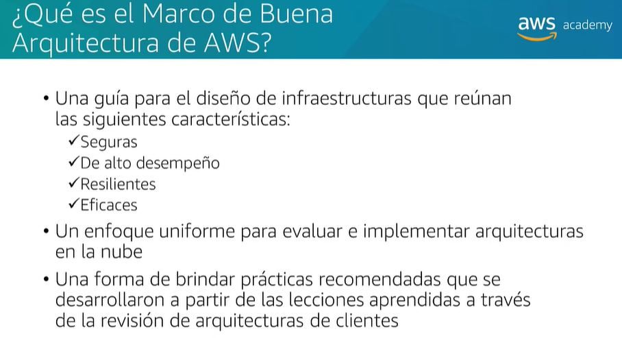
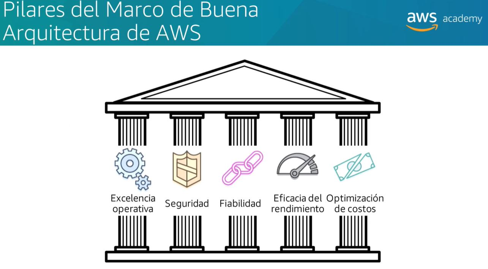
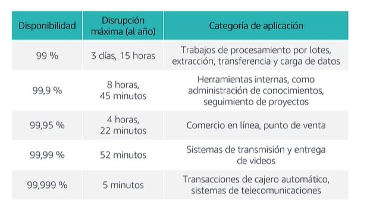

# Architecture in the Cloud

## AWS well-architected framework

- The AWS Well-Architected Framework helps you understand the pros and cons of decisions you make while building systems on AWS
- By using the Framework, you will learn architectural best practices for designing and operating reliable, secure, efficient, and cost-effective systems in the cloud

### 5 Pillars

- 1. Operational Excellence
  - The ability to run and monitor systems to deliver business value and to continually improve supporting processes and procedures.
    - Design Principles
      - **Perform operations as code**: Make routine operations procedures more efficient and repeatable by using automation
      - **Annotate documentation**: Make it easy for operations teams to understand your system
      - **Make frequent, small, reversible changes**: Reduce risk by making changes in small steps
      - **Refine operations procedures frequently**: Anticipate failure and learn from all operational failures
      - **Anticipate failure**: Learn from all operational failures
      - **Learn from all operational failures**: Learn from all operational failures
- 2. Security
    - The ability to protect information, systems, and assets while delivering business value through risk assessments and mitigation strategies.

      - Design Principles
        - **Implement a strong identity foundation**: Implement the principle of least privilege and enforce separation of duties with appropriate authorization for each interaction with your AWS resources
        - **Enable traceability**: Monitor, alert, and audit actions and changes to your environment in real time
        - **Apply security at all layers**: Apply a defense-in-depth approach with multiple security controls
        - **Automate security best practices**: Automate security best practices to increase speed and agility, and to reduce human error
        - **Protect data in transit and at rest**: Classify your data into sensitivity levels and use mechanisms, such as encryption, tokenization, and access control where appropriate
        - **Keep people away from data**: Reduce or eliminate the need for direct access or manual processing of data
        - **Prepare for security events**: Prepare for how to respond to an incident, including how to isolate affected components so that the rest of your environment can operate without interruption

- 3. Reliability
    - The ability of a system to recover from infrastructure or service disruptions, dynamically acquire computing resources to meet demand, and mitigate disruptions such as misconfigurations or transient network issues

      - Design Principles
        - **Test recovery procedures**: Test recovery procedures, such as recovering your environment, databases, and downstream applications, frequently and automatically
        - **Automatically recover from failure**: Automatically recover from failure by using high availability and autoscaling techniques
        - **Scale horizontally to increase aggregate system availability**: Scale horizontally to increase aggregate system availability
        - **Stop guessing capacity**: Remove guessing from capacity decisions by using autoscaling
        - **Manage change in automation**: Reduce risk of changes by codifying your infrastructure and configurations
        - **Refine operations procedures frequently**: Anticipate failure and learn from all operational failures
        - **Anticipate failure**: Learn from all operational failures
        - **Learn from all operational failures**: Learn from all operational failures

- 4. Performance Efficiency
    - The ability to use computing resources efficiently to meet system requirements, and to maintain that efficiency as demand changes and technologies evolve

      - Design Principles
        - **Democratize advanced technologies**: Democratize advanced technologies by making them accessible to everyone
        - **Go global in minutes**: Use global AWS Regions to deploy applications in multiple geographies around the world with a few clicks
        - **Use serverless architectures**: Use serverless architectures to remove the need to manage infrastructure
        - **Experiment more often**: Reduce the cost of failure and lower the cost to try new experiments
        - **Mechanical sympathy**: Understand how your system behaves on AWS and take advantage of different AWS services to improve performance
        - **Consider the tradeoffs between different architectures**: Consider the tradeoffs between different architectures and choose the approach that best fits your needs

- 5. Cost Optimization
    - The ability to run systems to deliver business value at the lowest price point

      - Design Principles
        - **Adopt a consumption model**: Match your payments to your usage so that you pay only for what you consume
        - **Measure overall efficiency**: Measure the business output of your system and correlate it with your costs and the resources you consume
        - **Stop spending money on data center operations**: Focus on your differentiators instead of spending resources on data center operations
        - **Analyze and attribute expenditure**: Analyze and attribute expenditure to business value
        - **Use managed and application level services to reduce cost of ownership**: Use managed and application level services to reduce cost of ownership
        - **Use managed and application level services to reduce cost of ownership**: Use managed and application level services to reduce cost of ownership
        - **Optimize over time**: Stop guessing capacity and provision just enough resources to meet demand
        - **Leverage elasticity to match supply with demand**: Leverage elasticity to match supply with demand and to maximize the efficiency of your resources

## Reliability and Availability

- **Reliability** is the ability of a system to recover from infrastructure or service disruptions, dynamically acquire computing resources to meet demand, and mitigate disruptions such as misconfigurations or transient network issues. **Is the probability that a system will function as expected during a specific period of time**.

- **Availability** is the proportion of time that a system is functional and working. **Is the probability that a system will be operational and functional at a given point in time**. For example, a system that is expected to be available 99.95% of the time in a given year can be expected to be down for 4.38 hours in that year.

- **High availability** is a characteristic of a system, which aims to ensure an agreed level of operational performance, usually uptime, for a higher than normal period. **Is a quality of a system or component that assures a high level of operational performance for a given period of time**.

- **Fault tolerance** is the property that enables a system to continue operating properly in the event of the failure of (or one or more faults within) some of its components. **Is the ability of a system to remain operational even if some of its components fail**.

- **Scalability** is the property of a system to handle a growing amount of work by adding resources to the system. **Is the ability of a system to handle increased load by adding resources**.

- **Recoverability** is the ability of a system to recover from infrastructure or service disruptions, dynamically acquire computing resources to meet demand, and mitigate disruptions such as misconfigurations or transient network issues. **Is the ability of a system to recover from infrastructure or service disruptions, dynamically acquire computing resources to meet demand, and mitigate disruptions such as misconfigurations or transient network issues**.

- **Recovery time objective (RTO)** is the maximum tolerable length of time that a computer, system, network, or application can be down after a failure or disaster occurs. **Is the maximum amount of time that a system can be down after a failure or disaster occurs**.

- **Recovery point objective (RPO)** is the maximum tolerable period in which data might be lost from an IT service due to a major incident. **Is the maximum amount of data loss that is acceptable during a disaster or failure**.

## AWS Trusted Advisor

- Is an online tool that provides you real time guidance to help you provision your resources following AWS best practices. **Is an online tool that provides you real time guidance to help you provision your resources following AWS best practices**.

- checks help optimize your AWS infrastructure, increase security and performance, reduce your overall costs, and monitor service limits. **Checks help optimize your AWS infrastructure, increase security and performance, reduce your overall costs, and monitor service limits**.

- provides recommendations in five categories: cost optimization, performance, security, fault tolerance, and service limits. **Provides recommendations in five categories: cost optimization, performance, security, fault tolerance, and service limits**.

  - **Cost Optimization** - Checks help you reduce cost by identifying idle and underutilized resources, EC2 Reserved Instance optimization opportunities, and overutilized resources.
  - **Performance** - Checks help you improve the responsiveness of your applications and the throughput of your database workloads.
  - **Security** - Checks help you improve the security of your AWS environment, including your AWS accounts, access keys, and IAM users.
  - **Fault Tolerance** - Checks help you increase the fault tolerance of your applications, including your EC2 instances, load balancers, and EBS volumes.
  - **Service Limits** - Checks help you monitor your service usage, including your Amazon EC2 Auto Scaling limits, Amazon EBS volume limits, and Amazon VPC limits.